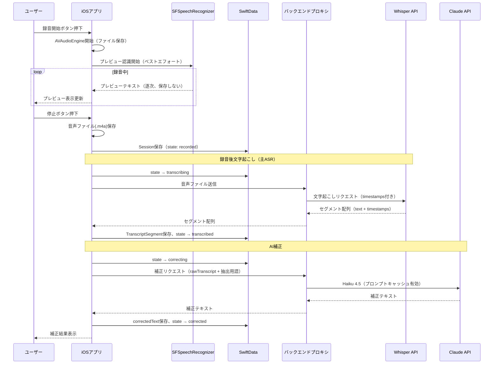
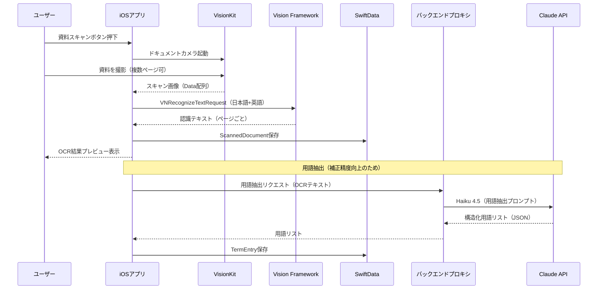
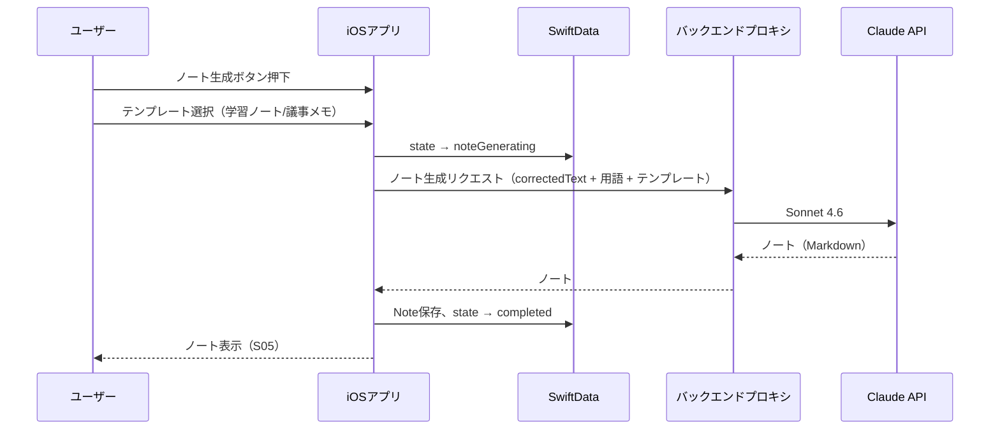
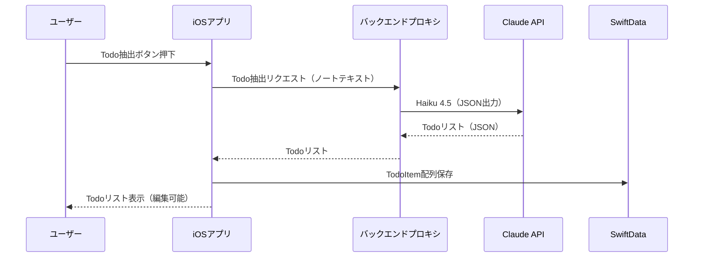

# KoeNote（コエノート）— 設計書

**バージョン**: 2.0  
**作成日**: 2026-04-18  
**ステータス**: ドラフト改定版

---

## 1. システムアーキテクチャ

### 1.1 全体構成

```
┌───────────────────────────────────────────────────────────┐
│                    iOSアプリ（SwiftUI）                     │
│                                                            │
│  ┌───────────┐  ┌──────────┐  ┌─────────────────────────┐ │
│  │ 録音エンジン │  │スキャンUI │  │ セッション管理           │ │
│  │AVFoundation│  │VisionKit │  │ SwiftData               │ │
│  └─────┬─────┘  └────┬─────┘  └───────────┬─────────────┘ │
│        │              │                    │                │
│  ┌─────▼──────────────▼────────────────────▼─────────────┐ │
│  │                ドメイン層（ビジネスロジック）             │ │
│  │  RecordingService │ OCRService │ NoteService            │ │
│  │  OfflineQueue     │ TermExtractor                       │ │
│  └─────┬──────────────────────────────────┬──────────────┘ │
│        │                                  │                 │
│  ┌─────▼────────────┐          ┌──────────▼─────────────┐  │
│  │ リアルタイムASR    │          │  APIGatewayClient      │  │
│  │ SFSpeechRecognizer│          │  （プロキシ経由）        │  │
│  │（プレビュー専用）  │          └──────────┬─────────────┘  │
│  └──────────────────┘                      │                │
└─────────────────────────────────────────────┼───────────────┘
                                              │ HTTPS
                                 ┌────────────▼────────────────┐
                                 │    バックエンドプロキシ        │
                                 │   （Cloudflare Workers等）    │
                                 │  ・APIキー管理               │
                                 │  ・デバイス認証・レート制限    │
                                 │  ・コスト上限制御             │
                                 └──┬───────────────────┬──────┘
                                    │                   │
                         ┌──────────▼──────┐  ┌────────▼──────────┐
                         │  OpenAI API     │  │  Anthropic API     │
                         │  Whisper        │  │  claude-haiku-4-5  │
                         │ （録音後ASR）    │  │  claude-sonnet-4-6 │
                         └─────────────────┘  └────────────────────┘

                         ┌─────────────────────────────────────────┐
                         │       Firebase（Phase 3〜）              │
                         │   Auth │ Firestore │ Storage            │
                         └─────────────────────────────────────────┘
```

### 1.2 ASR戦略（デュアルASR）

| ASR | 用途 | タイミング | 精度要件 |
|-----|------|-----------|---------|
| SFSpeechRecognizer | リアルタイムプレビュー | 録音中 | ベストエフォート（成功指標外） |
| Whisper API | 高精度文字起こし | 録音完了後 | WER < 20%（日本語） |

- 録音中はSFSpeechRecognizerでプレビューテキストを表示するが、このテキストは保存・後続処理には使用しない
- 録音完了後、音声ファイルをWhisper APIに送信し、タイムスタンプ付きの高精度な文字起こし結果を取得する
- SFSpeechRecognizerが利用不可（権限拒否等）でも録音とノート生成には影響しない

### 1.3 データフロー概要

```
音声入力
  → AVAudioEngine（録音・ファイル保存）
  → [並行] SFSpeechRecognizer（プレビュー表示、保存しない）
  → 録音停止
  → 音声ファイル(.m4a)をローカル保存
  → バックエンドプロキシ経由でWhisper API（高精度文字起こし）
  → rawTranscript保存（タイムスタンプ付きセグメント）
  → [資料あり] 用語抽出（OCRテキスト → 構造化用語リスト）
  → バックエンドプロキシ経由でClaude API（AI補正）
  → correctedTranscript保存
  → [ユーザー操作] ノート生成（Claude API）
  → ノート保存（Markdown）
```

---

## 2. 技術スタック

| レイヤー | 技術 | 選定理由 |
|----------|------|----------|
| UIフレームワーク | SwiftUI | iOS 17以降は宣言的UIが成熟。状態管理が容易 |
| 状態管理 | Observation（@Observable） | iOS 17で導入。Combine不要でシンプル |
| リアルタイムASR（プレビュー） | SFSpeechRecognizer | オンデバイス・無料・プライバシー保護。プレビュー専用 |
| 録音後ASR（主ASR） | OpenAI Whisper API | $0.006/分。長時間音声対応・高精度・日本語対応 |
| ドキュメントスキャン | VNDocumentCameraViewController | iOS標準。追加ライブラリ不要 |
| OCR | Vision（VNRecognizeTextRequest） | オンデバイス・高精度・日本語対応 |
| AI補正 | Claude API（Haiku 4.5） | 低コスト・高速。誤認識修正に十分な性能 |
| ノート生成 | Claude API（Sonnet 4.6） | 高品質な構造化文書生成に必要な推論力 |
| ローカルDB | SwiftData | iOS 17標準。CoreDataより宣言的で簡潔 |
| バックエンドプロキシ | Cloudflare Workers | エッジ実行・低レイテンシ・無料枠あり |
| ネットワーク | URLSession / async-await | 標準ライブラリで十分 |
| クラウドDB（Phase 3） | Firestore | リアルタイム同期・オフラインキャッシュ対応 |
| 認証（Phase 3） | Firebase Auth | Apple Sign In対応 |

---

## 3. 画面設計

### S01 ホーム（セッション一覧）

```
┌──────────────────────────────┐
│ KoeNote              [設定⚙] │
├──────────────────────────────┤
│ [🎙 新しい録音を開始]         │
├──────────────────────────────┤
│ 最近のセッション              │
│ ┌────────────────────────┐   │
│ │ 📄 2026/04/18 情報工学  │   │
│ │    52分 | ノート済      │   │
│ │    ● 処理完了           │   │
│ └────────────────────────┘   │
│ ┌────────────────────────┐   │
│ │ 📄 2026/04/15 マーケ勉強│   │
│ │    38分 | 補正済        │   │
│ │    ◐ ノート未生成       │   │
│ └────────────────────────┘   │
│ ┌────────────────────────┐   │
│ │ 🎙 2026/04/14 ゼミ     │   │
│ │    ⏳ 文字起こし中...    │   │
│ └────────────────────────┘   │
└──────────────────────────────┘
```

**主要要素**
- セッションカード：タイトル（編集可）・日時・録音時間・処理状態
- 処理状態インジケーター（録音済/文字起こし中/補正済/ノート済/エラー）
- 新規録音ボタン（常にアクセス可能）
- スワイプで削除

---

### S02 録音画面

```
┌──────────────────────────────┐
│ [←戻る]  録音中...   [📄資料]│
├──────────────────────────────┤
│                              │
│    ████ ▌▌▌██ ▌▌▌███        │
│         波形インジケーター     │
│         01:23:45             │
│                              │
├──────────────────────────────┤
│ プレビュー（参考表示）        │
│ ┌────────────────────────┐   │
│ │...本日は機械学習の基礎  │   │
│ │について説明します。まず │   │
│ │教師あり学習から...      │   │
│ └────────────────────────┘   │
│ ※録音後に高精度で文字起こし  │
├──────────────────────────────┤
│        [■ 停止]              │
└──────────────────────────────┘
```

**主要要素**
- 録音時間カウンター
- 音声波形インジケーター（AVAudioPCMBufferから生成）
- リアルタイムプレビュー（SFSpeechRecognizer、「参考表示」と明示）
- 資料スキャンボタン（録音中でもアクセス可）
- 停止ボタン → 自動で文字起こしジョブ開始 → S03へ遷移

---

### S03 セッション詳細

```
┌──────────────────────────────┐
│ [←] セッション詳細           │
├──────────────────────────────┤
│ 🤖 AI補正中...  ████░░ 60%   │
├───────┬──────────┬───────────┤
│[原文] │ [補正後] │ [ノート]  │
├───────┴──────────┴───────────┤
│ 補正後テキスト                │
│ ┌────────────────────────┐   │
│ │本日は機械学習の基礎につ │   │
│ │いて説明します。まず教師 │   │
│ │あり学習（supervised     │   │
│ │learning）から説明し...  │   │
│ └────────────────────────┘   │
│                              │
├──────────────────────────────┤
│ [📝 ノート生成] [📋 コピー]  │
└──────────────────────────────┘
```

**主要要素**
- 3タブ切替：原文（rawTranscript） / 補正後 / ノート
- 処理進捗インジケーター（文字起こし中/補正中）
- テキスト手動編集対応（補正後タブ）
- ノート生成ボタン（補正完了後に有効化）
- ノート生成時にテンプレート選択（学習ノート/議事メモ）
- Phase 1では差分ハイライト表示は行わない

---

### S04 ドキュメントスキャン

```
┌──────────────────────────────┐
│ [←] 資料スキャン             │
├──────────────────────────────┤
│                              │
│   [VisionKit カメラUI]       │
│   ドキュメントを枠内に        │
│   合わせてください            │
│                              │
│                              │
├──────────────────────────────┤
│ スキャン済み: 3ページ         │
│ [+ ページ追加] [✓ 完了]      │
└──────────────────────────────┘
```

**主要要素**
- VNDocumentCameraViewControllerの統合
- スキャン済みページのサムネイル一覧
- OCR処理状況表示
- セッションへの紐付け確認

---

### S05 ノート編集

```
┌──────────────────────────────┐
│ [←] ノート編集     [↗ 共有] │
├──────────────────────────────┤
│ テンプレート: 学習ノート      │
├──────────────────────────────┤
│ # 機械学習の基礎             │
│                              │
│ ## 主要概念                  │
│ - 教師あり学習               │
│   - 分類と回帰の違い         │
│ - 教師なし学習               │
│   - クラスタリング           │
│                              │
│ ## まとめ                    │
│ - ...                        │
│                              │
│ ## キーワード                │
│ supervised learning, ...     │
├──────────────────────────────┤
│ [🔄 再生成] [📋 コピー]     │
└──────────────────────────────┘
```

**主要要素**
- Markdown形式のノート表示・編集
- テンプレート種別表示
- 再生成ボタン（別テンプレートで再生成可能）
- 共有ボタン（テキスト共有）
- コピーボタン

---

## 4. データモデル

### 4.1 SwiftData（ローカル）

```swift
// MARK: - セッション

@Model
class Session {
    var id: UUID
    var title: String
    var createdAt: Date
    var duration: TimeInterval
    var audioRelativePath: String?    // Documents相対パス（URL非依存）
    var processingState: ProcessingState
    var failureReason: String?

    // 文字起こし（セグメント構造）
    var segments: [TranscriptSegment]
    // 補正後テキスト（全文結合キャッシュ）
    var correctedFullText: String?

    // ノート
    var note: Note?

    // 資料
    var documents: [ScannedDocument]
    var extractedTerms: [TermEntry]   // 資料から抽出した用語

    var tags: [String]
}

// MARK: - 処理状態

enum ProcessingState: String, Codable {
    case recording          // 録音中
    case recorded           // 録音完了、文字起こし待ち
    case transcribing       // Whisper API 処理中
    case transcribed        // 文字起こし完了、補正待ち
    case correcting         // AI補正中
    case corrected          // 補正完了（ノート未生成）
    case noteGenerating     // ノート生成中
    case completed          // 全処理完了
    case failed             // エラー発生（failureReasonに詳細）
}

// MARK: - 文字起こしセグメント

@Model
class TranscriptSegment {
    var id: UUID
    var session: Session
    var index: Int
    var text: String                 // ASR原文
    var correctedText: String?       // 補正後テキスト
    var startTime: TimeInterval      // 音声内の開始位置（秒）
    var endTime: TimeInterval        // 音声内の終了位置（秒）
}

// MARK: - スキャン資料

@Model
class ScannedDocument {
    var id: UUID
    var session: Session
    var pageIndex: Int
    var imageData: Data
    var ocrText: String
    var scannedAt: Date
}

// MARK: - 抽出用語

@Model
class TermEntry {
    var id: UUID
    var session: Session
    var term: String                 // 用語（表記）
    var reading: String?             // 読み（カタカナ）
    var category: String?            // 分類（人名/組織名/専門用語/略語等）
}

// MARK: - ノート

@Model
class Note {
    var id: UUID
    var session: Session
    var noteType: NoteType
    var content: String              // Markdown形式
    var createdAt: Date
    var updatedAt: Date
}

enum NoteType: String, Codable {
    case studyNote      // 学習ノート
    case meetingMemo    // 議事メモ
}

// MARK: - Phase 2

@Model
class TodoItem {
    var id: UUID
    var session: Session
    var title: String
    var dueDate: Date?
    var isCompleted: Bool
    var sourceQuote: String?         // 元の文字起こし参照箇所
    var createdAt: Date
}
```

### 4.2 Firestore スキーマ（Phase 3）

```
/users/{userId}
  - displayName: string
  - createdAt: timestamp

/projects/{projectId}
  - title: string
  - ownerId: string
  - memberIds: string[]              // UID配列（ルール判定用）
  - createdAt: timestamp

/projects/{projectId}/members/{userId}
  - role: "viewer" | "editor" | "admin"
  - joinedAt: timestamp

/projects/{projectId}/sessions/{sessionId}
  - title: string
  - createdAt: timestamp
  - duration: number
  - audioStoragePath: string
  - processingState: string
  - segments: [{text, correctedText, startTime, endTime}]
  - correctedFullText: string
  - noteType: string
  - noteContent: string
```

```javascript
// Firestore Security Rules
rules_version = '2';
service cloud.firestore {
  match /databases/{database}/documents {
    match /projects/{projectId} {
      allow read, write: if request.auth != null &&
        request.auth.uid in resource.data.memberIds;

      match /members/{userId} {
        allow read: if request.auth != null &&
          request.auth.uid in
            get(/databases/$(database)/documents/projects/$(projectId)).data.memberIds;
      }

      match /sessions/{sessionId} {
        allow read: if request.auth != null &&
          request.auth.uid in
            get(/databases/$(database)/documents/projects/$(projectId)).data.memberIds;
        allow write: if request.auth != null &&
          request.auth.uid in
            get(/databases/$(database)/documents/projects/$(projectId)).data.memberIds &&
          get(/databases/$(database)/documents/projects/$(projectId)/members/$(request.auth.uid)).data.role in ["editor", "admin"];
      }
    }
  }
}
```

---

## 5. 処理状態管理

### 5.1 状態遷移図

```
recording
  │ [停止]
  ▼
recorded
  │ [自動・ネットワーク接続時]
  ▼
transcribing ──[失敗]──→ failed
  │ [完了]                  ▲
  ▼                         │
transcribed                 │
  │ [自動]                  │
  ▼                         │
correcting ────[失敗]───────┘
  │ [完了]                  ▲
  ▼                         │
corrected                   │
  │ [ユーザー操作]          │
  ▼                         │
noteGenerating ─[失敗]──────┘
  │ [完了]
  ▼
completed
```

### 5.2 状態遷移ルール

| 遷移 | トリガー | 条件 |
|------|---------|------|
| recorded → transcribing | 録音停止後に自動 | ネットワーク接続あり |
| transcribed → correcting | 文字起こし完了後に自動 | — |
| corrected → noteGenerating | ユーザーがノート生成ボタン押下 | — |
| * → failed | API/ネットワークエラー | failureReasonに詳細記録 |
| failed → 失敗した段階 | ユーザーが再実行ボタン押下 | — |

---

## 6. 主要フローのシーケンス図

### 6.1 録音 → 録音後文字起こし → AI補正フロー



### 6.2 ドキュメントスキャン → 用語抽出フロー



### 6.3 ノート生成フロー



### 6.4 Todo抽出フロー（Phase 2）



---

## 7. Claude API 設計

### 7.1 用語抽出プロンプト

```
System:
あなたは資料テキストから専門用語・固有名詞を抽出する専門AIです。
以下のOCRテキストから、音声文字起こしの補正に役立つ用語を抽出してください。

出力形式（JSON）:
{
  "terms": [
    {"term": "表記", "reading": "カタカナ読み", "category": "専門用語|人名|組織名|略語|数値"}
  ]
}

抽出ルール:
- 一般的な日本語語彙は除外し、誤認識されやすい用語のみ抽出する
- 英語の専門用語はそのまま抽出する
- 読みが自明でない用語のみreadingを付与する
```

```
Human:
以下の資料テキストから用語を抽出してください:

{ocrText}
```

**使用モデル**: `claude-haiku-4-5-20251001`

---

### 7.2 ASR補正プロンプト

```
System（キャッシュ対象）:
あなたは音声文字起こしの補正専門AIです。
以下の用語リストを参考に、文字起こしテキストの誤認識を修正してください。

【参考用語リスト】
{extractedTerms を "term (reading) [category]" 形式で列挙}

補正ルール:
- 用語リストに含まれる専門用語・固有名詞・数字を優先して使用する
- 文脈から明らかな誤認識のみ修正し、意味のある言い回しは変えない
- 話し言葉のスタイルを維持する
- 補正後のテキストのみを出力する（説明は不要）
```

```
Human（キャッシュ非対象）:
以下の文字起こしテキストを補正してください:

{rawTranscript（チャンク分割時は1チャンク分）}
```

**使用モデル**: `claude-haiku-4-5-20251001`  
**キャッシュ戦略**: Systemプロンプト（用語リスト含む）に `cache_control: {"type": "ephemeral"}` を設定。同一セッション内でのチャンク分割処理時にキャッシュヒット。  
**チャンク分割**: 文字起こしテキストが約4,000文字を超える場合、セグメントのタイムスタンプ境界で分割して複数回呼び出す。

---

### 7.3 ノート生成プロンプト

```
System（キャッシュ対象）:
あなたは講義・会議の内容を整理するAIアシスタントです。
以下のフォーマットでノートを作成してください。

【テンプレート: {noteType}】
- studyNote（学習ノート）: トピック・主要概念・詳細説明・まとめ・キーワード
- meetingMemo（議事メモ）: 日時・議題・決定事項・未決事項・次のアクション

【参考用語リスト】
{extractedTerms}

出力形式: Markdown
```

```
Human（キャッシュ非対象）:
以下の文字起こしから{noteType}形式でノートを作成してください:

{correctedFullText}
```

**使用モデル**: `claude-sonnet-4-6`（高品質な構造化出力が必要なため）

---

### 7.4 Todo抽出プロンプト（Phase 2）

```
System:
あなたはアクションアイテム抽出の専門AIです。
テキストからTodoを抽出し、以下のJSON形式で出力してください。

出力形式:
{
  "todos": [
    {
      "title": "タスクの内容",
      "dueDate": "YYYY-MM-DD または null",
      "sourceQuote": "元テキストの該当箇所（50文字以内）"
    }
  ]
}
```

**使用モデル**: `claude-haiku-4-5-20251001`

---

## 8. バックエンドプロキシ設計

### 8.1 概要

APIキーの保護とコスト制御のため、すべての外部API呼び出しをバックエンドプロキシ経由で行う。

### 8.2 技術選定

| 候補 | 選定 | 理由 |
|------|------|------|
| Cloudflare Workers | ◎ | エッジ実行・低レイテンシ・無料枠10万リクエスト/日 |
| AWS Lambda | ○ | 実績豊富だがコールドスタートが課題 |
| Vercel Functions | ○ | Next.jsと親和性が高いが本件では不要 |

### 8.3 エンドポイント

| メソッド | パス | 処理 |
|----------|------|------|
| POST | /v1/transcribe | 音声ファイルをWhisper APIに転送、セグメント配列を返却 |
| POST | /v1/extract-terms | OCRテキストをClaude APIに送信、用語リストを返却 |
| POST | /v1/correct | 文字起こし＋用語をClaude APIに送信、補正テキストを返却 |
| POST | /v1/generate-note | 補正テキスト＋テンプレートをClaude APIに送信、ノートを返却 |
| POST | /v1/extract-todos | ノートテキストをClaude APIに送信、Todoリストを返却（Phase 2） |

### 8.4 認証・レート制限

- **Phase 1**: デバイスUUID ＋ アプリバンドルIDのHMAC署名で認証（ログイン不要）
- **Phase 3**: Firebase Auth トークンに切り替え
- **レート制限**: デバイスあたり1日10セッション、1セッション最大90分
- **コスト上限**: 月額APIコスト総額にアラート閾値を設定

---

## 9. セキュリティ設計

### 9.1 データ保護

| データ | 保存場所 | 保護方式 |
|--------|----------|----------|
| 音声ファイル（.m4a） | iOS Documents | NSFileProtectionComplete（デバイスロック時アクセス不可） |
| 文字起こし・ノート | SwiftData（SQLite） | NSFileProtectionComplete |
| スキャン画像 | iOS Documents | NSFileProtectionComplete |

### 9.2 API通信のセキュリティ

- すべてのAPI通信はHTTPS（TLS 1.3）
- APIキーはバックエンドプロキシのみが保持し、iOSアプリには埋め込まない
- アプリ → プロキシ間の認証はデバイスUUID署名（Phase 1）/ Firebaseトークン（Phase 3）
- 音声ファイルはWhisper API（プロキシ経由）にのみ送信。Claude APIにはテキストのみ送信

### 9.3 プライバシー配慮

- 個人情報マスキング：メールアドレス・電話番号を `[PERSONAL_INFO]` に置換（オプション設定）
- Whisper APIへの音声送信はユーザーに明示する（初回利用時の説明画面）

### 9.4 Firebase セキュリティルール（Phase 3）

4.2節のFirestoreスキーマに対応するセキュリティルールを参照。

---

## 10. バックグラウンド録音設計

### 10.1 AVAudioSession構成

```swift
let session = AVAudioSession.sharedInstance()
try session.setCategory(.playAndRecord, mode: .default, options: [.defaultToSpeaker])
try session.setActive(true)

// Info.plist に UIBackgroundModes: audio を設定
```

### 10.2 割り込みハンドリング

| イベント | 対応 |
|----------|------|
| 電話着信 | 録音を一時停止、通話終了後に再開。中断区間をセグメントで記録 |
| アラーム | 録音を一時停止、解除後に再開 |
| 他アプリの音声 | 録音を継続（ミキシング） |
| メモリ警告 | バッファをフラッシュしてファイル書き込み |

### 10.3 バッテリー・ストレージ目安

| 録音時間 | ファイルサイズ（AAC 64kbps） | バッテリー消費（目安） |
|----------|---------------------------|---------------------|
| 30分 | ~15 MB | ~3% |
| 60分 | ~30 MB | ~5% |
| 90分 | ~45 MB | ~8% |

---

## 11. オフラインキュー設計

### 11.1 方針

- オフライン時でも録音とローカル保存は完全に動作する
- ネットワークを必要とする処理（文字起こし・補正・ノート生成）はキューに保留する
- ネットワーク復帰時に自動でキューを処理する

### 11.2 実装

```swift
class OfflineQueue {
    /// NWPathMonitor でネットワーク状態を監視
    /// ネットワーク復帰時に pendingSessions を処理

    func enqueue(session: Session) {
        // processingState が recorded/transcribed の Session を検出
        // ネットワーク復帰後に自動実行
    }

    func processNext() async {
        // 1. recorded → transcribing: Whisper API呼び出し
        // 2. transcribed → correcting: Claude API呼び出し
        // 3. 失敗時: state → failed, failureReason記録, リトライポリシーに従う
    }
}
```

### 11.3 リトライポリシー

| 失敗種別 | リトライ | 間隔 |
|----------|---------|------|
| ネットワークエラー | 最大3回 | 指数バックオフ（5s → 15s → 45s） |
| APIレート制限（429） | 最大3回 | Retry-Afterヘッダーに従う |
| サーバーエラー（5xx） | 最大2回 | 30秒後 |
| クライアントエラー（4xx） | リトライなし | — |

---

## 12. APIコスト試算

### 前提条件

- 1セッション = 平均60分の講義/セミナー
- 文字起こし平均文字数: 約12,000文字（日本語 / 200文字/分）
- 日本語テキストのトークン換算: 1文字 ≈ 1.5トークン（平均）
- OCRテキスト: 約3,000文字（A4×5枚）
- 補正チャンク分割: 3チャンク（1チャンク ≈ 4,000文字）

### Whisper API コスト

| 処理 | 単価 | 時間 | コスト |
|------|------|------|--------|
| 音声文字起こし | $0.006/分 | 60分 | **$0.36** |

### Claude API コスト（1セッションあたり）

| 処理 | モデル | 入力トークン | 出力トークン | 概算コスト |
|------|--------|-------------|-------------|-----------|
| 用語抽出 | Haiku 4.5 | ~5,000 | ~1,000 | ~$0.01 |
| ASR補正（3チャンク、キャッシュ有効） | Haiku 4.5 | ~20,500 | ~18,000 | ~$0.10 |
| ノート生成 | Sonnet 4.6 | ~22,000 | ~2,000 | ~$0.10 |
| Todo抽出（Phase 2） | Haiku 4.5 | ~4,000 | ~1,000 | ~$0.01 |

### セッション合計

| パターン | コスト |
|----------|--------|
| 補正のみ（ノート未生成） | **~$0.47** |
| ノート生成あり | **~$0.57** |
| ノート ＋ Todo（Phase 2） | **~$0.58** |

### 月額コスト試算（ユーザー1人・週2回利用）

| パターン | 月額 |
|----------|------|
| 補正のみ | ~$3.8/月 |
| ノート生成あり | ~$4.6/月 |

**備考**: コストの約63%はWhisper API（$0.36/セッション）が占める。ユーザー規模拡大時は、faster-whisper等のセルフホストASRへの移行がコスト削減の主要施策となる。

---

## 13. ディレクトリ構成（Xcodeプロジェクト）

```
KoeNote/
├── App/
│   ├── KoeNoteApp.swift
│   └── ContentView.swift
├── Features/
│   ├── Home/
│   │   ├── HomeView.swift
│   │   └── HomeViewModel.swift
│   ├── Recording/
│   │   ├── RecordingView.swift
│   │   ├── RecordingViewModel.swift
│   │   └── WaveformView.swift
│   ├── Session/
│   │   ├── SessionDetailView.swift
│   │   └── SessionDetailViewModel.swift
│   ├── Scanner/
│   │   ├── DocumentScannerView.swift
│   │   ├── ScannerViewModel.swift
│   │   └── ScannedPageGridView.swift
│   ├── Note/
│   │   ├── NoteEditorView.swift
│   │   └── NoteViewModel.swift
│   └── Todo/                        # Phase 2
│       ├── TodoListView.swift
│       └── TodoViewModel.swift
├── Services/
│   ├── AudioRecorder.swift          # AVFoundation録音ラッパー
│   ├── RealtimePreviewService.swift # SFSpeechRecognizerプレビュー
│   ├── OCRService.swift             # Vision Frameworkラッパー
│   ├── APIGatewayClient.swift       # バックエンドプロキシクライアント
│   └── OfflineQueue.swift           # オフラインキュー管理
├── Models/
│   ├── Session.swift
│   ├── TranscriptSegment.swift
│   ├── ScannedDocument.swift
│   ├── TermEntry.swift
│   ├── Note.swift
│   └── TodoItem.swift               # Phase 2
├── Shared/
│   ├── Extensions/
│   └── Components/
└── Resources/
    └── Info.plist
```

---

## 14. 検証方法

### Phase 1 検証項目

| # | 検証対象 | 方法 | 合格基準 |
|---|---------|------|----------|
| 1 | 録音完了率 | 実機で30分・60分・90分の録音を各5回 | 95%以上で音声ファイル保存成功 |
| 2 | バックグラウンド録音 | 画面オフ→30分後に確認 | 録音継続・ファイル完全 |
| 3 | Whisper ASR精度 | WER計測（手動採点20サンプル） | WER < 20%（日本語） |
| 4 | AI補正効果（資料なし） | 補正前後WER比較（20サンプル） | 補正前比で20%以上改善 |
| 5 | AI補正効果（資料あり） | 補正前後WER比較（20サンプル） | 補正前比で30%以上改善 |
| 6 | 資料有無の精度差 | 同一音声で資料あり/なしを比較 | 資料ありのほうがWER低い |
| 7 | OCR精度 | A4資料10枚でOCRテキスト確認 | 認識率 > 95% |
| 8 | ノート生成E2E | 録音→文字起こし→補正→ノート生成の完走 | 10セッション中9以上で完走 |
| 9 | ノート品質 | 5段階評価（10サンプル） | 平均4.0以上 |
| 10 | オフライン→復帰 | 機内モードで録音→復帰後に処理再開 | 自動で文字起こし・補正が完走 |
| 11 | 処理時間 | 60分音声のE2E処理時間 | 文字起こし10分＋補正3分＋ノート1分以内 |
| 12 | エラーリカバリ | 補正中にネットワーク切断→復帰 | failed状態から再実行で完走 |
