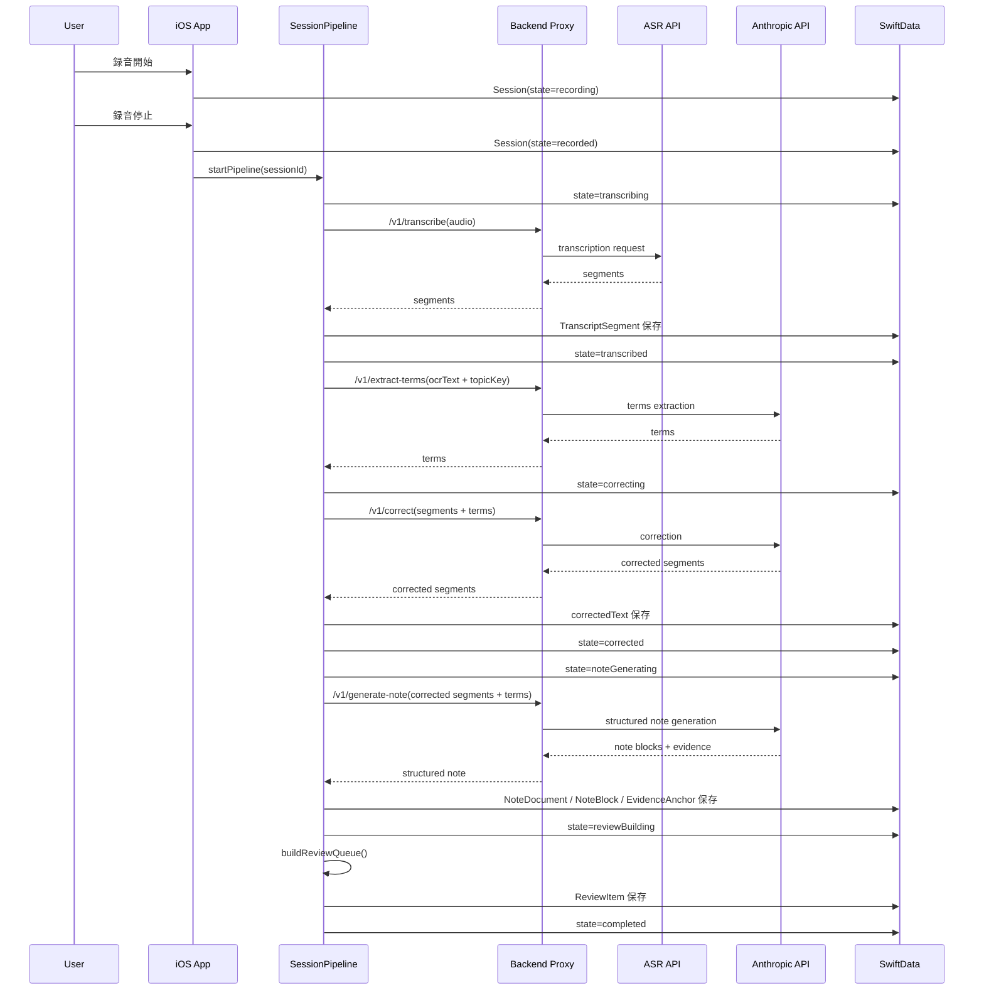
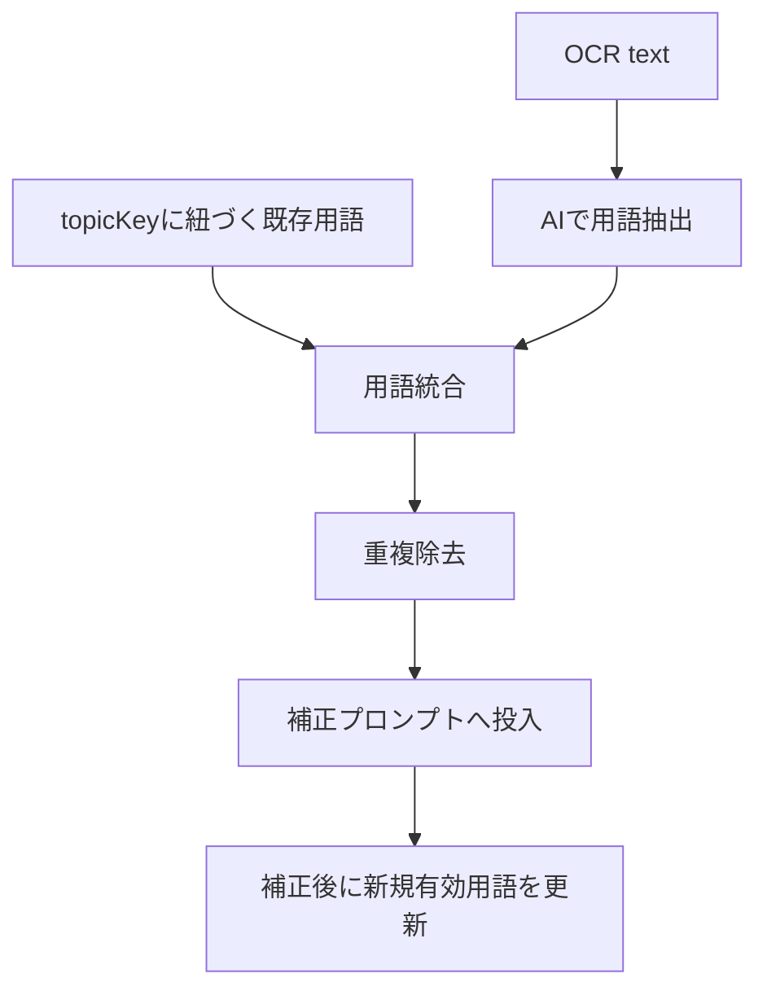

# KoeNote（コエノート）— 設計書

**バージョン**: 3.0  
**作成日**: 2026-04-19  
**ステータス**: 戦略整合版ドラフト

---

## 1. 設計方針

### 1.1 設計原則

KoeNote の設計は、次の4原則に従う。

1. **録音は絶対に落とさない**
価値の起点は音声データであるため、録音の堅牢性を最優先とする。

2. **AI出力は必ず根拠に紐付ける**
ノートは生成できるだけでなく、どの発話から生成されたかを追跡できる必要がある。

3. **資料と過去知識を積極活用する**
単発セッションではなく、継続利用で精度が上がる構造を持たせる。

4. **全文レビューを強いない**
ユーザーに全部を確認させず、怪しい箇所だけレビューさせる。

### 1.2 全体アーキテクチャ

```
┌──────────────────────────────────────────────────────────────┐
│                     iOS App（SwiftUI）                        │
│                                                              │
│  Recording UI   Session UI   Note UI   Review Queue UI       │
│       │            │           │             │                │
│       └────────────┴───────────┴─────────────┘                │
│                           │                                  │
│   ┌───────────────────────▼───────────────────────────────┐   │
│   │                  Application Layer                    │   │
│   │ RecordingCoordinator                                  │   │
│   │ SessionPipeline                                       │   │
│   │ NoteComposer                                          │   │
│   │ ReviewQueueBuilder                                    │   │
│   │ ContextMemoryManager                                  │   │
│   └───────────────┬───────────────────────┬───────────────┘   │
│                   │                       │                   │
│   ┌───────────────▼─────────────┐ ┌──────▼────────────────┐  │
│   │ Local Persistence            │ │ Device Services       │  │
│   │ SwiftData                    │ │ AVFoundation          │  │
│   │ Session / Segment / Note     │ │ Vision / VisionKit    │  │
│   │ Evidence / ReviewItem / Term │ │ SFSpeechRecognizer    │  │
│   └───────────────┬─────────────┘ └──────────┬────────────┘  │
│                   │                           │               │
└───────────────────┼───────────────────────────┼───────────────┘
                    │                           │
                    │ HTTPS                     │ Local preview only
                    ▼                           ▼
          ┌──────────────────────┐    ┌────────────────────────┐
          │ Backend Proxy        │    │ Realtime Preview ASR    │
          │ Auth / Rate Limit    │    │ SFSpeechRecognizer      │
          │ Cost Control         │    │ 非保存・参考表示のみ     │
          └──────┬─────────┬─────┘    └────────────────────────┘
                 │         │
        ┌────────▼───┐ ┌──▼─────────────┐
        │ OpenAI API │ │ Anthropic API  │
        │ ASR        │ │ Correction /   │
        │            │ │ Note / Terms   │
        └────────────┘ └────────────────┘
```

---

## 2. 価値を生むコアパイプライン

### 2.1 Phase 1 の処理パイプライン

```
録音
  → 音声ファイル保存
  → 高精度ASR
  → セグメント化された原文保存
  → OCR + 用語抽出
  → 用語メモリ統合
  → セグメント単位補正
  → 根拠付きノート生成
  → レビューキュー生成
```

### 2.2 差別化ポイントがどこで生まれるか

| 段階 | 一般的なサービス | KoeNote |
|------|------------------|---------|
| 文字起こし | 全文化して終わり | セグメント + 時間情報を保持 |
| 資料活用 | OCRを添付するだけ | 用語抽出して補正へ反映 |
| 要約 | 本文から要約を生成 | 根拠参照付きノートを生成 |
| 品質確認 | 全文を人が確認 | 低信頼箇所だけレビュー |
| 学習 | セッションごとに完結 | 用語メモリが次回へ継承 |

---

## 3. 技術スタック

| レイヤー | 技術 | 理由 |
|----------|------|------|
| UI | SwiftUI | iOS 17 以降で十分成熟 |
| 状態管理 | Observation | 軽量で ViewModel と相性が良い |
| 録音 | AVFoundation | バックグラウンド録音に対応 |
| リアルタイム参考表示 | SFSpeechRecognizer | プレビュー専用で利用 |
| 録音後ASR | OpenAI API | 長時間音声に対応しやすい |
| OCR | Vision / VisionKit | 標準フレームワークで十分 |
| AI補正 / 用語抽出 / ノート生成 | Anthropic API | 構造化出力と要約品質を活かす |
| ローカルDB | SwiftData | 構造化モデル管理が容易 |
| バックエンドプロキシ | Cloudflare Workers | キー秘匿・レート制限・低運用コスト |
| 同期（Phase 3） | Firebase | Auth / Firestore / Storage をまとめて扱える |

---

## 4. 画面設計

### S01 ホーム

```
┌──────────────────────────────┐
│ KoeNote              [設定⚙] │
├──────────────────────────────┤
│ [🎙 録音を開始]              │
├──────────────────────────────┤
│ 最近のセッション              │
│ ┌────────────────────────┐   │
│ │ 📄 情報工学 第12回      │   │
│ │    52分 │ ✅ 完了       │   │
│ │    🔗 用語23件蓄積済み   │   │
│ └────────────────────────┘   │
│ ┌────────────────────────┐   │
│ │ 📄 マーケ勉強会         │   │
│ │    38分 │ ⏳ 補正中...  │   │
│ └────────────────────────┘   │
│ ┌────────────────────────┐   │
│ │ 🎙 ゼミ                │   │
│ │    ☁️ オフライン保留     │   │
│ └────────────────────────┘   │
└──────────────────────────────┘
```

- セッションカード：タイトル（編集可）・録音時間・処理状態・用語蓄積状況
- 処理状態は `SessionState` に連動
- テーマタグ（topicKey）をカードに表示し、同テーマの連続性を示す

### S02 録音画面

```
┌──────────────────────────────┐
│ [←戻る]  録音中...   [📄資料]│
├──────────────────────────────┤
│    ████ ▌▌▌██ ▌▌▌███        │
│         波形インジケーター     │
│         01:23:45             │
├──────────────────────────────┤
│ プレビュー（参考表示）        │
│ ┌────────────────────────┐   │
│ │...本日は機械学習の基礎  │   │
│ │について説明します...    │   │
│ └────────────────────────┘   │
│ ※録音後に高精度で処理します  │
├──────────────────────────────┤
│        [■ 停止]              │
└──────────────────────────────┘
```

- プレビューは SFSpeechRecognizer による参考表示（保存しない）
- 停止後は自動でパイプライン開始、S03へ遷移

### S03 セッション詳細

```
┌──────────────────────────────┐
│ [←] 情報工学 第12回  [テーマ]│
├──────────────────────────────┤
│ ✅ 完了  │  ⚠ 要レビュー 3件 │
├───────┬──────────┬───────────┤
│[原文] │ [補正後] │ [ノート]  │
├───────┴──────────┴───────────┤
│ ノート                       │
│ ┌────────────────────────┐   │
│ │ ## 主要概念             │   │
│ │ 教師あり学習は入力と... │   │
│ │ 📎 "教師あり学習はラベル│   │
│ │    付きデータから..."   │   │
│ │    🔊 01:23 ▶           │   │
│ └────────────────────────┘   │
├──────────────────────────────┤
│ [📝 再生成] [⚠ レビュー] [↗]│
└──────────────────────────────┘
```

- 3タブ：原文 / 補正後 / ノート
- ノートタブでは各ブロックに根拠引用が表示される
- 📎 引用をタップ → 元セグメント表示
- 🔊 ボタンをタップ → 該当区間の音声を再生
- ⚠ レビューボタンでレビューキュー画面（S06）へ遷移

### S04 ドキュメントスキャン

```
┌──────────────────────────────┐
│ [←] 資料スキャン             │
├──────────────────────────────┤
│   [VisionKit カメラUI]       │
├──────────────────────────────┤
│ スキャン済み: 3ページ         │
│ 抽出用語: 15件               │
│ [+ ページ追加] [✓ 完了]      │
└──────────────────────────────┘
```

### S05 ノート編集

```
┌──────────────────────────────┐
│ [←] ノート編集     [↗ 共有] │
├──────────────────────────────┤
│ テンプレート: 学習ノート      │
├──────────────────────────────┤
│ # 機械学習の基礎             │
│                              │
│ ## 主要概念                  │
│ - 教師あり学習    📎🔊       │
│ - 教師なし学習    📎🔊       │
│                              │
│ ## まとめ                    │
│ - ...             📎🔊       │
├──────────────────────────────┤
│ [🔄 再生成] [📋 コピー]     │
└──────────────────────────────┘
```

- 各ブロック右端に根拠アイコン（📎）と音声再生アイコン（🔊）
- Markdown編集モードと閲覧モードの切替

### S06 レビューキュー

```
┌──────────────────────────────┐
│ [←] レビュー対象  3/8件 確認済│
├──────────────────────────────┤
│ 🔴 優先度: 高                │
│ ┌────────────────────────┐   │
│ │ セグメント #14          │   │
│ │ "きょうしありがくしゅう"│   │
│ │ → 「教師あり学習」?     │   │
│ │ 理由: 用語と音が近いが  │   │
│ │       補正未適用        │   │
│ │ [✓ 確認済] [✏ 修正]    │   │
│ └────────────────────────┘   │
│ 🟡 優先度: 中                │
│ ┌────────────────────────┐   │
│ │ ノートブロック #3       │   │
│ │ 「回帰分析の精度は...」 │   │
│ │ 理由: 根拠セグメントなし│   │
│ │ [✓ 確認済] [✏ 修正]    │   │
│ └────────────────────────┘   │
└──────────────────────────────┘
```

- レビュー対象を優先度順に一覧表示
- 各アイテムに理由と推奨アクションを表示
- 確認済みマークで進捗管理
- 修正ボタンで該当セグメントまたはノートブロックへジャンプ

---

## 5. ドメインモデル

### 5.1 モデル全体像

KoeNote の中核は `Session` ではなく、**Session + Segment + Evidence + TermMemory + ReviewItem** の組み合わせである。

```swift
@Model
final class Session {
    var id: UUID
    var title: String
    var createdAt: Date
    var duration: TimeInterval
    var audioRelativePath: String?
    var state: SessionState
    var failureReason: String?
    var topicKey: String?               // 同一テーマ識別用（ユーザー設定 or AI提案）
    var pipelineAttemptId: UUID?        // 冪等性保証用

    @Relationship(deleteRule: .cascade)
    var segments: [TranscriptSegment]

    @Relationship(deleteRule: .cascade)
    var documents: [ScannedDocument]

    @Relationship(deleteRule: .cascade)
    var notes: [NoteDocument]

    @Relationship(deleteRule: .cascade)
    var reviewItems: [ReviewItem]
}

@Model
final class TranscriptSegment {
    var id: UUID
    var session: Session
    var index: Int
    var rawText: String
    var correctedText: String?
    var startTime: TimeInterval
    var endTime: TimeInterval
    var confidenceScore: Double?
    var needsReview: Bool
}

@Model
final class ScannedDocument {
    var id: UUID
    var session: Session
    var pageIndex: Int
    var imagePath: String
    var ocrText: String
}

@Model
final class TermMemoryEntry {
    var id: UUID
    var topicKey: String
    var term: String
    var reading: String?
    var category: String
    var source: String                  // document / correction / user
    var isDisabled: Bool
    var lastUsedAt: Date
}

@Model
final class NoteDocument {
    var id: UUID
    var session: Session
    var type: NoteType
    var markdown: String

    @Relationship(deleteRule: .cascade)
    var blocks: [NoteBlock]
}

@Model
final class NoteBlock {
    var id: UUID
    var note: NoteDocument
    var order: Int
    var heading: String?
    var body: String
    var blockType: String               // summary / decision / concept / action
    var confidenceScore: Double?

    @Relationship(deleteRule: .cascade)
    var evidences: [EvidenceAnchor]
}

@Model
final class EvidenceAnchor {
    var id: UUID
    var block: NoteBlock
    var segmentIndex: Int
    var quote: String
    var startTime: TimeInterval
    var endTime: TimeInterval
}

@Model
final class ReviewItem {
    var id: UUID
    var session: Session
    var type: ReviewItemType            // low_confidence_segment / weak_evidence_block
    var targetId: UUID
    var reason: String
    var priority: Int
    var resolved: Bool
}

enum SessionState: String, Codable {
    case recording
    case recorded
    case transcribing
    case transcribed
    case correcting
    case corrected
    case noteGenerating
    case reviewBuilding
    case completed
    case failed
}

enum NoteType: String, Codable {
    case studyNote
    case meetingMemo
}

enum ReviewItemType: String, Codable {
    case lowConfidenceSegment
    case weakEvidenceBlock
}
```

### 5.2 なぜこのモデルが必要か

- `TranscriptSegment` を持つことで、発話区間へ戻れる
- `EvidenceAnchor` を持つことで、ノートに根拠を持たせられる
- `TermMemoryEntry` を持つことで、次回セッションに学習を持ち越せる
- `ReviewItem` を持つことで、全文レビューを回避できる

---

## 6. 主要コンポーネント設計

### 6.1 RecordingCoordinator

責務:

- AVAudioSession と AVAudioEngine の制御
- 録音ファイルの生成と終了処理
- バックグラウンド録音継続
- 任意でリアルタイムプレビュー開始

### 6.2 SessionPipeline

責務:

- `recorded -> transcribing -> correcting -> noteGenerating -> reviewBuilding` の遷移管理
- API呼び出しのオーケストレーション
- 冪等な再実行
- 失敗時の状態保持

### 6.3 ContextMemoryManager

責務:

- OCR由来の用語抽出
- topicKey 単位の既存用語取得
- 補正ジョブへ渡す用語セットの統合
- 不要用語の無効化反映

topicKey 割り当て戦略:

- ユーザーがセッション作成時に手動設定（「情報工学」「マーケゼミ」等）
- 未設定の場合、ノート生成後にAIがタイトルからトピックを提案し、ユーザーが承認する
- 同一 topicKey のセッション間で TermMemoryEntry を共有する

### 6.4 NoteComposer

責務:

- 補正済みセグメント列からノートを生成
- AI出力を `NoteBlock` 単位へ変換
- 各ブロックに `EvidenceAnchor` を付与

### 6.5 ReviewQueueBuilder

責務:

- セグメント信頼度、未一致用語、根拠不足ブロックを評価
- レビュー対象を優先度付きで生成

---

## 7. 主要フロー

### 7.1 録音からノート完成まで



### 7.2 用語メモリ統合フロー



### 7.3 レビューキュー生成ルール

レビュー対象は以下の複合条件で作る。

- ASR / 補正信頼度が閾値未満
- 用語メモリに近いが未一致な語が存在
- ノートブロックに evidence が 0 件
- 1ブロックあたりの evidence 数が少なすぎる
- 引用と本文の意味距離が大きい

---

## 8. API設計

### 8.1 プロキシの責務

- APIキー隠蔽
- デバイス認証
- レート制限
- コスト制御
- レスポンスの正規化
- 将来のモデル差し替え吸収

### 8.2 エンドポイント

| Method | Path | AIモデル | 入力 | 出力 |
|--------|------|---------|------|------|
| POST | `/v1/transcribe` | Whisper（gpt-4o-transcribe） | 音声ファイル | `segments[]`（timestamps付き） |
| POST | `/v1/extract-terms` | claude-haiku-4-5 | OCRテキスト, topicKey | `terms[]` |
| POST | `/v1/correct` | claude-haiku-4-5 | raw segments, terms | `correctedSegments[]` |
| POST | `/v1/generate-note` | claude-sonnet-4-6 | corrected segments, noteType, terms | `noteBlocks[]` + `evidences[]` |

**レビューキュー生成はローカル処理**（6.5 ReviewQueueBuilder）で行い、API呼び出しは不要。

### 8.3 APIレスポンス例

#### `/v1/generate-note`

```json
{
  "noteBlocks": [
    {
      "order": 1,
      "heading": "主要概念",
      "body": "教師あり学習は入力と正解ラベルの対応から学習する手法。",
      "blockType": "concept",
      "confidenceScore": 0.91,
      "evidences": [
        {
          "segmentIndex": 12,
          "quote": "教師あり学習はラベル付きデータから学ぶ手法です",
          "startTime": 120.4,
          "endTime": 126.8
        }
      ]
    }
  ]
}
```

### 8.4 冪等性

- 各セッションに `pipelineAttemptId` を持たせる
- 同一段階の再試行では重複保存を避ける
- `generate-note` は既存ノートの上書きか版管理かを明示する

---

## 9. プロンプト設計

### 9.1 用語抽出プロンプト

**目的**: OCR全文をそのまま渡さず、補正に効く語彙だけへ圧縮する

```
System:
あなたは資料テキストから専門用語・固有名詞を抽出する専門AIです。
以下のOCRテキストから、音声文字起こしの補正に役立つ用語を抽出してください。

出力形式（JSON）:
{
  "terms": [
    {"term": "表記", "reading": "カタカナ読み", "category": "専門用語|人名|組織名|略語|数値"}
  ]
}

抽出ルール:
- 一般的な日本語語彙は除外し、誤認識されやすい用語のみ抽出する
- 英語の専門用語はそのまま抽出する
- 略語がある場合は正式名称を term に、略語を reading に記載する
- 読みが自明でない用語のみ reading を付与する
```

```
Human:
以下の資料テキストから用語を抽出してください:

{ocrText}
```

**モデル**: `claude-haiku-4-5-20251001`

### 9.2 補正プロンプト

**目的**: raw segment を意味改変せずに修正する

```
System（キャッシュ対象）:
あなたは音声文字起こしの補正専門AIです。
以下の用語リストを参考に、文字起こしセグメントの誤認識を修正してください。

【参考用語リスト】
{terms を "term (reading) [category]" 形式で列挙}

補正ルール:
- 用語リストに含まれる専門用語・固有名詞・数字を優先して使用する
- 文脈から明らかな誤認識のみ修正し、意味のある言い回しは変えない
- 話し言葉のスタイルを維持する
- セグメントの分割は変更しない
- 各セグメントに対して補正後テキストと信頼度スコア（0.0〜1.0）を返す
- 信頼度が低い箇所（曖昧な修正）は 0.7 未満とする

出力形式（JSON）:
{
  "segments": [
    {"index": 0, "correctedText": "...", "confidenceScore": 0.95},
    {"index": 1, "correctedText": "...", "confidenceScore": 0.62}
  ]
}
```

```
Human（キャッシュ非対象）:
以下の文字起こしセグメントを補正してください:

{segments を index, rawText, startTime, endTime で列挙}
```

**モデル**: `claude-haiku-4-5-20251001`  
**キャッシュ戦略**: Systemプロンプト（用語リスト含む）に `cache_control: {"type": "ephemeral"}` を設定。チャンク分割時にキャッシュヒット。  
**チャンク分割**: 合計約4,000文字を超える場合、セグメント境界で分割して複数回呼び出す。

### 9.3 根拠付きノート生成プロンプト

**目的**: ノート本文だけでなく、ブロックごとの evidence を生成する

```
System（キャッシュ対象）:
あなたは講義・会議の内容を構造化するAIアシスタントです。
補正済みセグメント列から、根拠付きのノートを生成してください。

【テンプレート: {noteType}】
- studyNote: トピック → 主要概念 → 詳細説明 → まとめ → キーワード
- meetingMemo: 議題 → 決定事項 → 未決事項 → 次のアクション

【参考用語リスト】
{terms}

必須ルール:
- 各ブロックに最低1件の evidence（元セグメントからの引用）を付与する
- evidence の quote は元セグメントの原文をそのまま引用する（50文字以内）
- evidence の segmentIndex, startTime, endTime は元セグメントと一致させる
- 元発話で確認できない推論や補足は blockType を "inference" とし、confidenceScore を 0.5 以下にする
- 根拠が十分なブロックは confidenceScore を 0.8 以上にする

出力形式（JSON）:
{
  "noteBlocks": [
    {
      "order": 1,
      "heading": "見出し",
      "body": "本文（Markdown）",
      "blockType": "concept|decision|summary|action|inference",
      "confidenceScore": 0.91,
      "evidences": [
        {
          "segmentIndex": 12,
          "quote": "元セグメントからの引用",
          "startTime": 120.4,
          "endTime": 126.8
        }
      ]
    }
  ]
}
```

```
Human（キャッシュ非対象）:
以下の補正済みセグメントから{noteType}形式のノートを生成してください:

{correctedSegments を index, correctedText, startTime, endTime で列挙}
```

**モデル**: `claude-sonnet-4-6`

### 9.4 レビューキュー生成（ローカル処理）

レビューキューはAPI呼び出しではなく、ローカルのルールベースで生成する。

**レビュー対象の判定ルール**:

| ルール | 優先度 | 対象 |
|--------|--------|------|
| セグメント confidenceScore < 0.7 | 高 | lowConfidenceSegment |
| ノートブロックに evidence が 0 件 | 高 | weakEvidenceBlock |
| ノートブロック confidenceScore < 0.6 | 中 | weakEvidenceBlock |
| ノートブロック blockType が "inference" | 中 | weakEvidenceBlock |
| 用語メモリに近いが未一致な語が存在 | 低 | lowConfidenceSegment |

---

## 10. ローカルデータ戦略

### 10.1 保存単位

| データ | 保存先 |
|--------|--------|
| 音声ファイル | Documents 配下 |
| OCR画像 | Documents 配下 |
| 構造化データ | SwiftData |

### 10.2 保存ポリシー

- 音声は相対パスで保持し、移動耐性を持たせる
- ノートは `markdown` と `blocks` の両方を保持する
- evidence はブロック側にネストせず独立モデルで持ち、後から再構築しやすくする

---

## 11. 音声再生設計（Evidence Playback）

### 11.1 概要

ノートブロックの根拠引用（EvidenceAnchor）から元音声の該当区間を再生する機能。KoeNote の「信頼できるノート」体験の中核。

### 11.2 再生仕様

| 項目 | 仕様 |
|------|------|
| 再生区間 | `startTime - 2秒` 〜 `endTime + 2秒`（前後にバッファ） |
| 再生速度 | 1.0x / 1.5x / 2.0x 切替可 |
| UI | インライン再生（ミニプレイヤー） |
| 操作 | タップで再生/停止、スワイプで前後セグメントへ |

### 11.3 実装方針

```swift
class EvidencePlayer {
    private let audioEngine = AVAudioPlayerNode()

    func play(evidence: EvidenceAnchor, audioPath: String) {
        let start = max(0, evidence.startTime - 2.0)
        let end = evidence.endTime + 2.0
        // AVAudioFile のフレーム位置を計算し、区間再生
    }
}
```

- 音声ファイルは端末内に保持されているため、ネットワーク不要
- 複数の evidence を連続再生するモード（セッション通し聴き）も将来対応可

---

## 12. 処理完了通知

### 12.1 概要

録音停止後のパイプライン処理（文字起こし → 補正 → ノート生成）はバックグラウンドで数分かかる。ユーザーが他の作業をしている間に処理が完了したことをプッシュ通知で伝える。

### 12.2 通知タイミング

| イベント | 通知内容 |
|----------|---------|
| ノート生成完了 | 「📝 [セッション名] のノートが完成しました」 |
| レビュー対象あり | 「⚠ [N]件の確認事項があります」（ノート完了通知に併記） |
| 処理失敗 | 「❌ [セッション名] の処理でエラーが発生しました」 |

### 12.3 実装方針

- `UNUserNotificationCenter` によるローカル通知
- パイプライン完了時に `SessionPipeline` から通知をスケジュール
- アプリがフォアグラウンドの場合はバナー表示のみ

---

## 13. バックグラウンドと障害対応

### 13.1 録音

- `UIBackgroundModes: audio` を利用
- 端末ロック中の録音継続を前提設計
- 割り込み時はセグメント境界を記録

### 13.2 オフラインキュー

```swift
final class OfflinePipelineQueue {
    func enqueueTranscription(for sessionId: UUID) {}
    func resumePendingJobs() async {}
    func markFailed(sessionId: UUID, reason: String) {}
}
```

### 13.3 リトライポリシー

| 失敗種別 | リトライ |
|----------|---------|
| ネットワークエラー | 3回 |
| 429 | Retry-After 優先 |
| 5xx | 2回 |
| 4xx | リトライしない |

---

## 14. セキュリティ設計

### 14.1 基本方針

- クライアントに秘密情報を置かない
- 録音データは必要最小限の送信に留める
- Phase 1 では個人利用でも安心して使えることを優先する

### 14.2 具体策

- APIキーはバックエンドプロキシのみ保持
- 通信は HTTPS（TLS 1.3）前提
- Phase 1 はデバイスUUID + バンドルIDのHMAC署名で簡易認証
- Phase 3 で Firebase Auth トークンベースへ移行
- 音声ファイルはASR API以外には送信しない（AI補正にはテキストのみ）

---

## 15. Firestore 設計（Phase 3）

### 15.1 コレクション

```
/users/{userId}
/projects/{projectId}
/projects/{projectId}/members/{userId}
/projects/{projectId}/sessions/{sessionId}
/projects/{projectId}/terms/{termId}
```

### 15.2 方針

- `memberIds` はルール判定用に保持
- 詳細ロールは `members` サブコレクションで管理
- セッション共有時は note, review, term memory を含める

---

## 16. コスト試算

### 16.1 前提条件

- 1セッション = 平均60分
- 文字起こし平均文字数: 約12,000文字（200文字/分）
- 日本語トークン換算: 1文字 ≈ 1.5トークン
- OCRテキスト: 約3,000文字（A4×5枚）
- 補正チャンク分割: 3チャンク

### 16.2 セッションあたりコスト

| 処理 | モデル | 入力トークン | 出力トークン | コスト |
|------|--------|-------------|-------------|--------|
| 音声文字起こし | Whisper | — | — | $0.36 |
| 用語抽出 | Haiku 4.5 | ~5,000 | ~1,000 | ~$0.01 |
| 補正（3チャンク） | Haiku 4.5 | ~20,500 | ~18,000 | ~$0.10 |
| ノート生成 | Sonnet 4.6 | ~22,000 | ~3,000 | ~$0.11 |
| **合計** | | | | **~$0.58** |

### 16.3 月額試算（1ユーザー・週2回）

| パターン | 月額 |
|----------|------|
| フル利用 | ~$4.6 |

### 16.4 コストの支配要因と抑制策

- **Whisper API が全体の62%**（$0.36/セッション）を占める
- コスト抑制策:
  - OCR全文ではなく用語抽出結果を補正へ渡す（トークン削減）
  - セグメントを適切にチャンク化しキャッシュヒット率を上げる
  - ノート生成は構造化JSONで冗長文を減らす
  - ユーザー規模拡大時は faster-whisper セルフホストASRへの移行を検討

---

## 17. 検証戦略

### 17.1 技術検証

| # | 項目 | 方法 | 合格基準 |
|---|------|------|----------|
| 1 | 60分録音 | 実機で5回 | ファイル破損なし |
| 2 | 90分録音 | 実機で3回 | アプリクラッシュなし |
| 3 | バックグラウンド録音 | 画面オフ→30分後確認 | 録音継続・ファイル完全 |
| 4 | 文字起こし速度 | 60分音声で計測 | 10分以内 |
| 5 | OCR精度 | 資料10枚 | 認識率 > 95% |
| 6 | オフライン→復帰 | 機内モードで録音→復帰 | 自動で処理完走 |

### 17.2 価値検証

| # | 項目 | 方法 | 合格基準 |
|---|------|------|----------|
| 1 | 根拠付きノート | ノートブロック検査 | 90%以上に evidence 存在 |
| 2 | 資料活用効果 | 同一音声で資料あり/なし比較 | 資料ありのほうがWER低い |
| 3 | 補正精度（資料あり） | WER計測（20サンプル） | 補正前比 30%以上改善 |
| 4 | レビューキュー有効性 | 実修正箇所との照合 | 70%以上を先回り検出 |
| 5 | 手修正時間 | 被験者5名で計測 | 平均5分以内 |
| 6 | 用語メモリ効果 | 同テーマ2回目セッションの精度 | 1回目より改善 |

### 17.3 UX検証

| # | 項目 | 方法 | 合格基準 |
|---|------|------|----------|
| 1 | 初回録音開始 | 初見ユーザー5名 | 30秒以内に開始 |
| 2 | ノート信頼感 | 5段階評価アンケート | 平均4.0以上 |
| 3 | 根拠再生体験 | 被験者に引用タップを促す | 「元音声が聞けて安心」の回答70%以上 |
| 4 | レビューキューUX | 被験者にレビュー操作を依頼 | 「全文見直しより楽」の回答80%以上 |
| 5 | 処理待ち体験 | パイプライン処理中の行動観察 | 通知を受けて再開できる |

---

## 18. 実装優先順位

### 18.1 先に作るもの

1. 録音の堅牢化（バックグラウンド・割り込み対応）
2. 録音後ASR（Whisper API連携）
3. セグメント保存（タイムスタンプ付き）
4. OCR + 用語抽出
5. 用語メモリ（ローカル）
6. AI補正（信頼度スコア付き）
7. 根拠付きノート生成
8. Evidence Playback（音声区間再生）
9. レビューキュー
10. 処理完了通知

### 18.2 後回しにするもの

1. 高度なリアルタイム表示
2. 派手な差分可視化
3. クラウド同期
4. チーム共同編集

