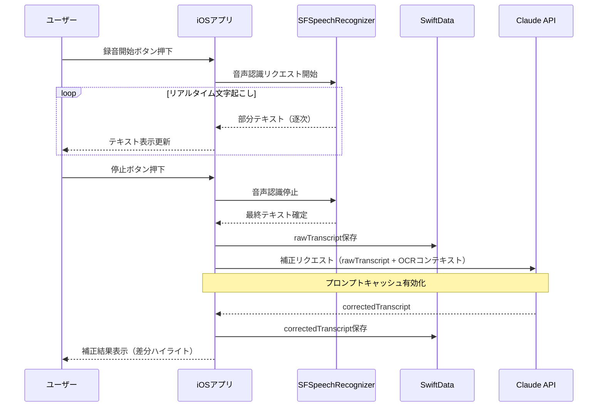
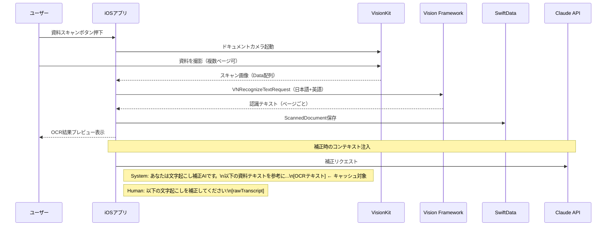
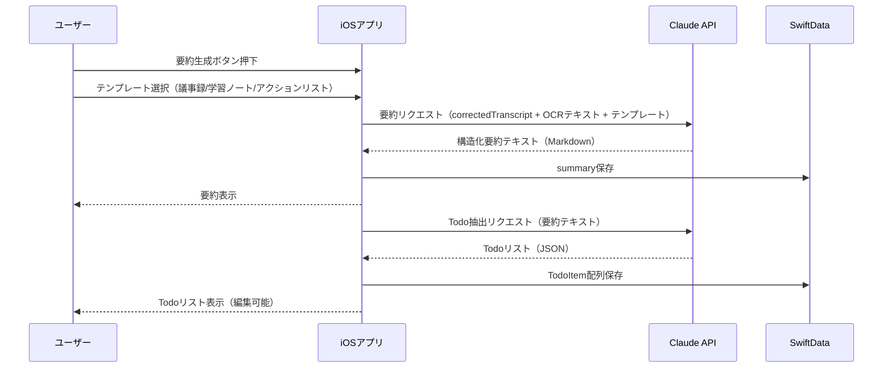

# KoeNote（コエノート）— 設計書

**バージョン**: 1.0  
**作成日**: 2026-04-18  
**ステータス**: ドラフト

---

## 1. システムアーキテクチャ

### 1.1 全体構成

```
┌─────────────────────────────────────────────────────┐
│                   iOSアプリ（SwiftUI）               │
│                                                     │
│  ┌──────────┐  ┌──────────┐  ┌──────────────────┐  │
│  │ 録音エンジン│  │スキャンUI│  │ セッション管理    │  │
│  │AVFoundation│  │VisionKit │  │ SwiftData        │  │
│  └─────┬────┘  └────┬─────┘  └────────┬─────────┘  │
│        │             │                 │             │
│  ┌─────▼─────────────▼─────────────────▼──────────┐ │
│  │               ドメイン層（ビジネスロジック）      │ │
│  │  ASRService │ OCRService │ SummaryService       │ │
│  └─────┬─────────────────────────────┬────────────┘ │
│        │                             │              │
│  ┌─────▼──────┐              ┌───────▼──────────┐   │
│  │ ローカルASR │              │  Claude API Client│   │
│  │SFSpeechRec.│              │  (AI補正・要約)    │   │
│  └────────────┘              └───────┬──────────┘   │
└──────────────────────────────────────┼──────────────┘
                                       │ HTTPS
                          ┌────────────▼──────────────┐
                          │      Anthropic API         │
                          │  claude-haiku-4-5 (補正)   │
                          │  claude-sonnet-4-6 (要約)  │
                          └───────────────────────────┘

                    ┌──────────────────────────────────┐
                    │      Firebase（Phase 3〜）        │
                    │  Auth | Firestore | Storage       │
                    └──────────────────────────────────┘
```

### 1.2 データフロー概要

```
音声入力
  → AVAudioEngine（バッファキャプチャ）
  → SFSpeechRecognizer（リアルタイムASR）
  → TranscriptBuffer（UIに逐次反映）
  → 録音停止
  → Claude API（補正プロンプト）
       ↑ + OCRテキスト（スキャン済みの場合）
  → CorrectedTranscript（UI更新）
  → ローカル保存（SwiftData）
```

---

## 2. 技術スタック

| レイヤー | 技術 | 選定理由 |
|----------|------|----------|
| UIフレームワーク | SwiftUI | iOS 17以降は宣言的UIが成熟。状態管理が容易 |
| 状態管理 | Observation（@Observable） | iOS 17で導入。Combine不要でシンプル |
| リアルタイムASR | SFSpeechRecognizer | オフライン動作・無料・プライバシー保護 |
| 高精度ASR（オプション） | OpenAI Whisper API | $0.006/分。精度が必要な場面でフォールバック |
| ドキュメントスキャン | VNDocumentCameraViewController | iOS標準。追加ライブラリ不要 |
| OCR | Vision（VNRecognizeTextRequest） | オンデバイス・高精度・日本語対応 |
| AI補正・要約 | Claude API（Anthropic SDK） | Haiku 4.5で低コスト補正、Sonnet 4.6で高品質要約 |
| ローカルDB | SwiftData | iOS 17標準。CoreDataより宣言的で簡潔 |
| クラウドDB（Phase 3） | Firestore | リアルタイム同期・オフラインキャッシュ対応 |
| 認証（Phase 3） | Firebase Auth | Apple/Google Sign In・メール認証 |
| ファイルストレージ（Phase 3） | Firebase Storage | 音声ファイル・PDF共有 |
| ネットワーク | URLSession / async-await | 標準ライブラリで十分 |

---

## 3. 画面設計

### S01 ホーム（セッション一覧）

```
┌──────────────────────────────┐
│ KoeNote              [設定⚙] │
├──────────────────────────────┤
│ [🎙 新しい録音を開始]         │
├──────────────────────────────┤
│ 最近のセッション              │
│ ┌────────────────────────┐   │
│ │ 📄 2026/04/18 情報工学  │   │
│ │    52分 | 補正済 | Todo3│   │
│ └────────────────────────┘   │
│ ┌────────────────────────┐   │
│ │ 📄 2026/04/15 マーケ勉強│   │
│ │    38分 | 補正済       │   │
│ └────────────────────────┘   │
└──────────────────────────────┘
```

**主要要素**
- セッションカード：タイトル（編集可）・日時・録音時間・Todo件数
- 新規録音ボタン（常にアクセス可能）
- スワイプで削除

---

### S02 録音画面

```
┌──────────────────────────────┐
│ [←戻る]  録音中...   [📄資料]│
├──────────────────────────────┤
│                              │
│    ████ ▌▌▌██ ▌▌▌███        │
│         波形インジケーター     │
│         01:23:45             │
│                              │
├──────────────────────────────┤
│ リアルタイム文字起こし         │
│ ┌────────────────────────┐   │
│ │...本日は機械学習の基礎  │   │
│ │について説明します。まず │   │
│ │教師あり学習から...      │   │
│ └────────────────────────┘   │
├──────────────────────────────┤
│        [■ 停止]              │
└──────────────────────────────┘
```

**主要要素**
- 録音時間カウンター
- 音声波形インジケーター（AVAudioPCMBufferから生成）
- リアルタイム文字起こしスクロールビュー（自動スクロール）
- 資料スキャンボタン（録音中でもアクセス可）
- 停止ボタン → S03へ遷移

---

### S03 文字起こし表示・補正

```
┌──────────────────────────────┐
│ [←] 文字起こし  [補正前][補正後]│
├──────────────────────────────┤
│ 🤖 AI補正中...  ████░░ 60%   │
├──────────────────────────────┤
│ 補正後テキスト                │
│ ┌────────────────────────┐   │
│ │本日は機械学習の基礎につ │   │
│ │いて説明します。まず教師 │   │
│ │あり学習（supervised     │   │
│ │learning）から説明し...  │   │
│ └────────────────────────┘   │
│ ~~変更箇所がハイライト表示~~  │
├──────────────────────────────┤
│ [📝 要約を生成]  [📋 コピー]  │
└──────────────────────────────┘
```

**主要要素**
- 補正前/補正後タブ切替
- 補正進捗インジケーター
- 差分ハイライト（変更箇所を色付き表示）
- テキスト手動編集対応
- 要約生成ボタン（Phase 2）

---

### S04 ドキュメントスキャン

```
┌──────────────────────────────┐
│ [←] 資料スキャン             │
├──────────────────────────────┤
│                              │
│   [VisionKit カメラUI]       │
│   ドキュメントを枠内に        │
│   合わせてください            │
│                              │
│                              │
├──────────────────────────────┤
│ スキャン済み: 3ページ         │
│ [+ ページ追加] [✓ 完了]      │
└──────────────────────────────┘
```

**主要要素**
- VNDocumentCameraViewControllerの統合
- スキャン済みページのサムネイル一覧
- OCR処理状況表示
- セッションへの紐付け確認

---

## 4. データモデル

### 4.1 SwiftData（ローカル）

```swift
@Model
class Session {
    var id: UUID
    var title: String
    var createdAt: Date
    var duration: TimeInterval
    var audioFileURL: URL?
    var rawTranscript: String        // ASR生テキスト
    var correctedTranscript: String? // AI補正後テキスト
    var summary: String?             // 要約テキスト
    var summaryType: SummaryType?    // 議事録/学習ノート/アクションリスト
    var documents: [ScannedDocument]
    var todos: [TodoItem]
    var tags: [String]
    var isCorrected: Bool
    var isSummarized: Bool
}

@Model
class ScannedDocument {
    var id: UUID
    var session: Session
    var pageIndex: Int
    var imageData: Data
    var ocrText: String
    var scannedAt: Date
}

@Model
class TodoItem {
    var id: UUID
    var session: Session
    var title: String
    var dueDate: Date?
    var isCompleted: Bool
    var assigneeId: String?   // Phase 3: FirebaseユーザーID
    var sourceQuote: String?  // 元の文字起こし参照箇所
    var createdAt: Date
}

enum SummaryType: String, Codable {
    case minutes        // 議事録
    case studyNote      // 学習ノート
    case actionList     // アクションリスト
}
```

### 4.2 Firestore スキーマ（Phase 3）

```
/projects/{projectId}
  - title: string
  - ownerId: string
  - createdAt: timestamp
  - members: [{userId, role: "viewer"|"editor"|"admin"}]

/projects/{projectId}/sessions/{sessionId}
  - title: string
  - createdAt: timestamp
  - duration: number
  - audioStoragePath: string     // Firebase Storage パス
  - rawTranscript: string
  - correctedTranscript: string
  - summary: string
  - isCorrected: boolean
  - isSummarized: boolean

/projects/{projectId}/sessions/{sessionId}/todos/{todoId}
  - title: string
  - dueDate: timestamp
  - isCompleted: boolean
  - assigneeId: string
  - sourceQuote: string
  - createdAt: timestamp
```

---

## 5. 主要フローのシーケンス図

### 5.1 録音 → 文字起こし → AI補正フロー



### 5.2 ドキュメントスキャン → コンテキスト注入フロー



### 5.3 停止 → 要約生成 → Todo抽出フロー（Phase 2）



---

## 6. Claude API 設計

### 6.1 ASR補正プロンプト

```
System（キャッシュ対象）:
あなたは音声文字起こしの補正専門AIです。
以下の配布資料の内容を参考に、文字起こしテキストの誤認識を修正してください。

【配布資料テキスト】
{ocrText}

補正ルール:
- 資料に含まれる専門用語・固有名詞・数字を優先して使用する
- 文脈から明らかな誤認識のみ修正し、意味のある言い回しは変えない
- 話し言葉のスタイルを維持する
- 補正後のテキストのみを出力する（説明は不要）
```

Human（キャッシュ非対象）:
以下の文字起こしテキストを補正してください:

{rawTranscript}
```

**使用モデル**: `claude-haiku-4-5-20251001`  
**キャッシュ戦略**: Systemプロンプト（OCRテキスト含む）に `cache_control: {"type": "ephemeral"}` を設定。同一セッション内での複数回呼び出しでキャッシュヒット。

---

### 6.2 要約生成プロンプト（Phase 2）

```
System（キャッシュ対象）:
あなたは会議・講義の内容を整理するAIアシスタントです。
以下のフォーマットで要約を作成してください。

【テンプレート: {summaryType}】
- minutes（議事録）: 日時・参加者・議題・決定事項・アクションアイテム
- studyNote（学習ノート）: トピック・主要概念・まとめ・キーワード
- actionList（アクションリスト）: やること・担当・期日・背景

【参考資料テキスト】
{ocrText}

出力形式: Markdown
```

Human（キャッシュ非対象）:
以下の文字起こしを{summaryType}形式で要約してください:

{correctedTranscript}
```

**使用モデル**: `claude-sonnet-4-6`（高品質な構造化出力が必要なため）

---

### 6.3 Todo抽出プロンプト（Phase 2）

```
System:
あなたはアクションアイテム抽出の専門AIです。
テキストからTodoを抽出し、以下のJSON形式で出力してください。

出力形式:
{
  "todos": [
    {
      "title": "タスクの内容",
      "dueDate": "YYYY-MM-DD または null",
      "assignee": "担当者名 または null",
      "sourceQuote": "元テキストの該当箇所（50文字以内）"
    }
  ]
}
```

**使用モデル**: `claude-haiku-4-5-20251001`（構造化JSON出力はHaikuで十分）

---

## 7. セキュリティ設計

### 7.1 音声データの保護

| データ | 保存場所 | 暗号化 |
|--------|----------|--------|
| 音声ファイル（.m4a） | iOS Documents（Data Protection: Complete） | AES-256（iOS標準） |
| 文字起こしテキスト | SwiftData（SQLiteファイル） | AES-256（iOS標準） |
| スキャン画像 | iOS Documents（Data Protection: Complete） | AES-256（iOS標準） |
| APIキー | iOS Keychain | Keychain暗号化 |

### 7.2 Claude API 呼び出し時のプライバシー配慮

- 音声ファイル自体はAPIに送信しない（文字起こしテキストのみ）
- 個人情報マスキング：メールアドレス・電話番号を `[PERSONAL_INFO]` に置換（オプション設定）
- APIキーはKeychainに保存し、Info.plistには含めない

### 7.3 Firebase セキュリティルール（Phase 3）

```javascript
// Firestore Rules
rules_version = '2';
service cloud.firestore {
  match /databases/{database}/documents {
    match /projects/{projectId} {
      // オーナーまたはメンバーのみアクセス可
      allow read, write: if request.auth != null &&
        (resource.data.ownerId == request.auth.uid ||
         request.auth.uid in resource.data.members.map(m => m.userId));

      match /sessions/{sessionId} {
        allow read: if request.auth != null &&
          isProjectMember(projectId);
        allow write: if request.auth != null &&
          isProjectEditor(projectId);
      }
    }
  }
}
```

---

## 8. APIコスト試算

### 前提条件

- 1セッション = 平均60分の講義/セミナー
- 文字起こし平均文字数: 約12,000文字（日本語 / 200文字/分）
- OCRテキスト: 約3,000文字（A4×5枚）

### Claude API コスト（1セッションあたり）

| 処理 | モデル | 入力トークン | 出力トークン | 概算コスト |
|------|--------|-------------|-------------|-----------|
| ASR補正（キャッシュ初回） | Haiku 4.5 | ~5,000 | ~4,500 | ~$0.003 |
| ASR補正（キャッシュヒット） | Haiku 4.5 | ~500 | ~4,500 | ~$0.001 |
| 要約生成 | Sonnet 4.6 | ~7,000 | ~1,500 | ~$0.025 |
| Todo抽出 | Haiku 4.5 | ~2,000 | ~500 | ~$0.001 |
| **合計（要約あり）** | | | | **~$0.030** |
| **合計（補正のみ）** | | | | **~$0.003** |

**月額コスト試算（ユーザー1人・週2回利用）**
- 補正のみ: ~$0.024/月
- 要約あり: ~$0.24/月

---

## 9. ディレクトリ構成（Xcodeプロジェクト）

```
KoeNote/
├── App/
│   ├── KoeNoteApp.swift
│   └── ContentView.swift
├── Features/
│   ├── Home/
│   │   ├── HomeView.swift
│   │   └── HomeViewModel.swift
│   ├── Recording/
│   │   ├── RecordingView.swift
│   │   ├── RecordingViewModel.swift
│   │   └── WaveformView.swift
│   ├── Transcript/
│   │   ├── TranscriptView.swift
│   │   ├── TranscriptViewModel.swift
│   │   └── DiffHighlightView.swift
│   ├── Scanner/
│   │   ├── DocumentScannerView.swift
│   │   ├── ScannerViewModel.swift
│   │   └── ScannedPageGridView.swift
│   ├── Summary/          # Phase 2
│   │   ├── SummaryView.swift
│   │   └── SummaryViewModel.swift
│   └── Todo/             # Phase 2
│       ├── TodoListView.swift
│       └── TodoViewModel.swift
├── Services/
│   ├── ASRService.swift          # SFSpeechRecognizer ラッパー
│   ├── OCRService.swift          # Vision Framework ラッパー
│   ├── ClaudeAPIClient.swift     # Anthropic API クライアント
│   └── AudioRecorder.swift       # AVFoundation ラッパー
├── Models/
│   ├── Session.swift             # SwiftData モデル
│   ├── ScannedDocument.swift
│   └── TodoItem.swift
├── Shared/
│   ├── Extensions/
│   └── Components/
└── Resources/
    └── Info.plist
```

---

## 10. 検証方法

### Phase 1 検証項目

| 項目 | 方法 | 合格基準 |
|------|------|----------|
| 文字起こし遅延 | 実機でストップウォッチ計測 | 発話から2秒以内 |
| ASR精度（補正前） | WER計測（手動採点10サンプル） | WER < 20%（日本語） |
| ASR精度（補正後） | WER計測（手動採点10サンプル） | 補正前比 30%以上改善 |
| OCR精度 | A4資料5枚でOCRテキスト確認 | 認識率 > 95% |
| バックグラウンド録音 | 画面オフ→5分後に確認 | 録音継続・テキスト反映 |
| オフライン動作 | 機内モードで録音・文字起こし | ASRは動作、AI補正はスキップ |